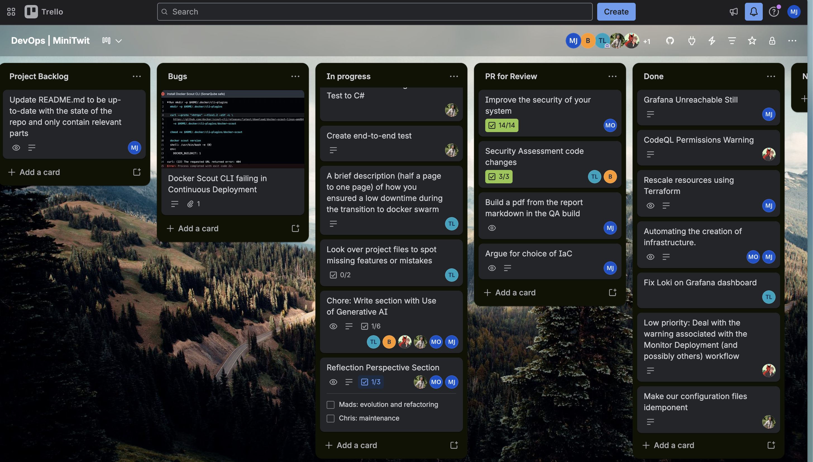
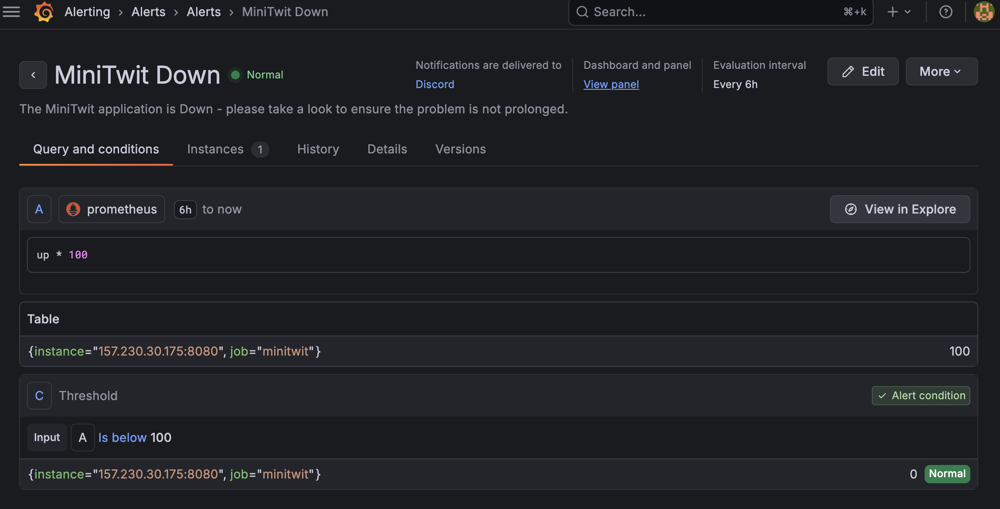
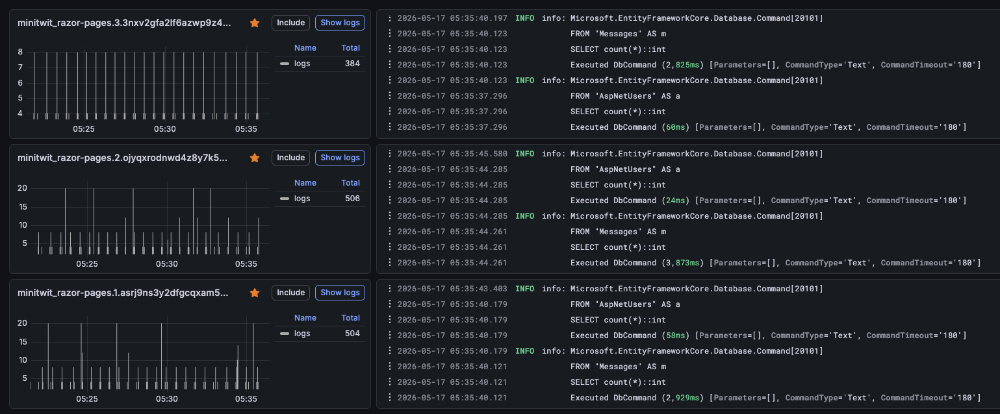
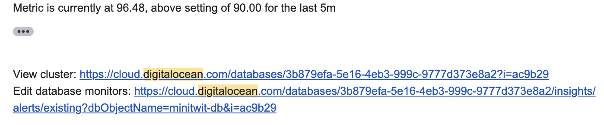
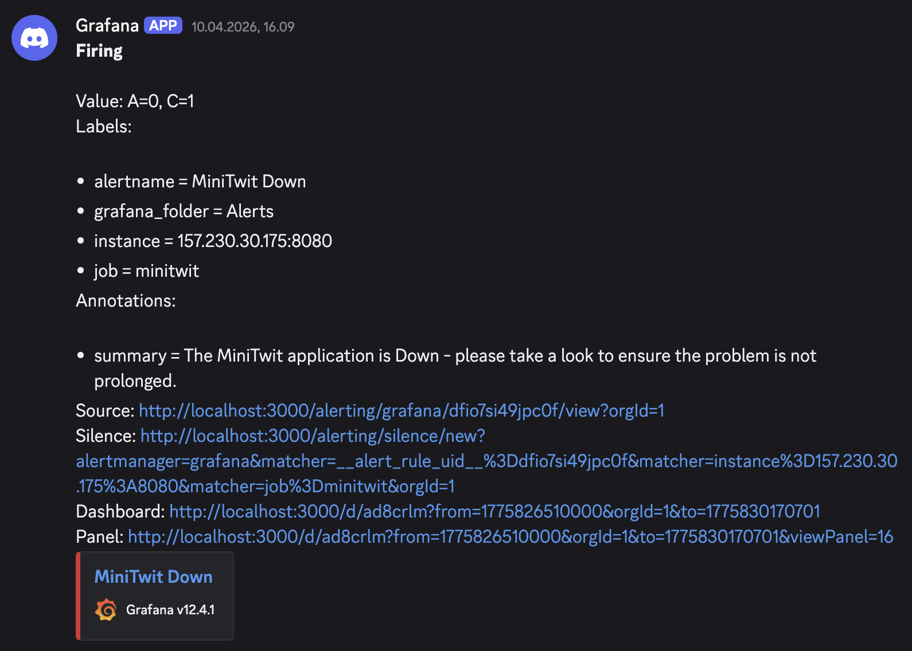
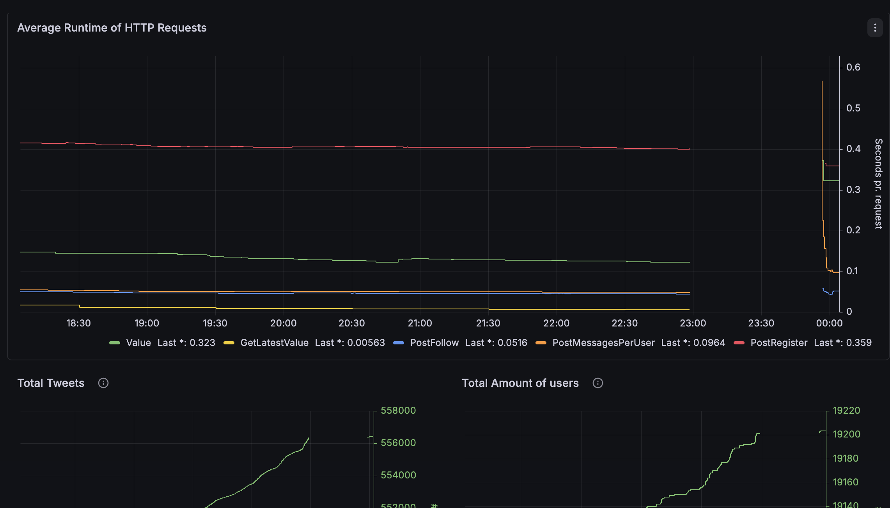

# DevOps, Software Evolution and Software Maintenance, MSc
\vspace{1cm}

\begin{center}
\textbf{Course Code: KSDSESM1KU}
\end{center}

\begin{center}
\textbf{Assignment By:}
\end{center}

\begin{center}
\begin{tabular}{|c|c|}
\hline
\textbf{Name} & \textbf{Email} \\
\hline
Daniel Ring Hansen & darh@itu.dk \\
Krzysztof Michal Parocki & krpa@itu.dk \\
Mads Orfelt & orfe@itu.dk \\
Mie Jonasson & miejo@itu.dk \\
Patrick Tristan Søborg & ptso@itu.dk \\
Tien Cam Ly & tily@itu.dk \\
\hline
\end{tabular}
\end{center}

\begin{center}
\textbf{18 May 2026}
\end{center}

\newpage

## 1. System's Perspective

### 1.1 Design and Architecture
We chose C# as the programming language for refactoring. The project was built with Razor Pages ([Documentation](https://learn.microsoft.com/en-us/aspnet/core/razor-pages/?view=aspnetcore-10.0&tabs=visual-studio)) and Entity Framework Core (EF Core) ([Documentation](https://learn.microsoft.com/en-us/ef/core/)).
The choice of C# was made due to part of the group's existing familiarity with the language, which streamlined development, especially when it came to the architecture.

The project follows Onion Architecture in three layers: Core, Infrastructure, and Web. The visualization below shows each layer's responsibilities:

- The **Core layer** handles Data Transfer Objects (DTOs) and repository interfaces. It does not reference frameworks or libraries, staying independent from the rest of the system.
- The **Infrastructure layer** handles the database context, migrations, and repository implementations. It depends only on Core and does not reference Web.
- The **Web layer** handles the UI through Razor Pages and the API. It acts as the system entry point, handling dependency injection and referencing Core and Infrastructure.

#### 1.1.1 Choice of Final Infrastructure-as-Code Architecture
We migrated to Terraform late in the project for easier maintenance and resource control via defined interfaces. Terraform documents DigitalOcean resources well, so defining existing Vagrant deployments and "Click-Ops" resources added little overhead.

### 1.2 Dependencies of MiniTwit

- **Git / GitHub** *(Development, CI/CD)* Source control, reviews, workflows
- **Trello** *(Development, operations)* Backlog and work tracking
- **Discord** *(Development, operations)* Team communication and alerts (e.g. GitHub & Grafana webhooks)
- **C# / .NET** *(Development, production)* Application language and runtime
- **NuGet** *(Development, CI/CD)* .NET package restore
- **ASP.NET Core (Razor Pages)** *(Development, production)* Web UI and HTTP API
- **Entity Framework Core** *(Development, production)* Database access and migrations
- **PostgreSQL** *(Development, testing, production)* Primary data store (DigitalOcean)
- **Docker** *(Development, CI/CD, production)* Container images and runtime
- **Docker Hub** *(CI/CD, production)* Application image registry
- **Docker Compose** *(Development, testing)* Local/test multi-container setups
- **Docker Swarm** *(Production)* Orchestration and rolling updates
- **DigitalOcean** *(Infrastructure, CI/CD, production)* Cloud VMs, managed DB, networking, Spaces Object storage (Terraform state backend)
- **Terraform** *(Infrastructure, CI/CD)* Infrastructure as code for DigitalOcean
- **GitHub Actions** *(CI/CD)* CI/CD pipelines
- **Third-party GitHub Actions** *(CI/CD)* Marketplace workflow steps (e.g. checkout, Docker login, Terraform, PR comments, GitHub App token)
- **Ubuntu** *(CI/CD, production)* OS on runners and droplets
- **SSH (OpenSSH)** *(CI/CD, production)* Remote deploy and server access
- **Prometheus** *(Monitoring)* Metrics Data Gatherer
- **Grafana** *(Monitoring)* Dashboards and alerts
- **Loki** *(Monitoring)* Log storage
- **Promtail** *(Monitoring)* Log shipping to Loki
- **Python** *(Testing (local and CI/CD))* API simulator driver
- **Selenium** *(Testing (local and CI/CD))* Browser UI tests (Chrome in Docker)
- **dotnet format** *(Development, CI/CD)* C# format check in CI
- **Roslynator** *(Development, CI/CD)* C# static analysis
- **Codespell** *(Development, CI/CD)* Spell checking
- **Hadolint** *(Development, CI/CD)* Dockerfile linting
- **Codacy** *(Development, CI/CD)* Hosted PR static analysis
- **SonarCloud** *(Development, CI/CD)* Analysis and PR quality gate
- **CodeQL** *(Development, CI/CD)* Security/quality scanning (e.g. C#, Python) on PRs
- **Docker Scout** *(CI/CD)* Image vulnerability scans on QA builds
- **OpenAPI Generator** *(Development)* API simulator stub from OpenAPI
- **Pandoc** *(Report CI/CD)* Report Markdown to PDF
- **LaTeX (pdflatex / TeX Live)** *(Report CI/CD)* PDF engine for Pandoc
- **librsvg (rsvg-convert)** *(Report CI/CD)* SVG conversion for Pandoc
- **GNU Make** *(Development, CI/CD)* Local and CI task automation

#### Libraries

NuGet references come from `razor-pages/Web` and `razor-pages/Infrastructure`. Python test libraries are listed below with some having pinned versions in `tests/selenium/requirements.txt`.

- **Microsoft.AspNetCore.Identity.EntityFrameworkCore** *(Web, Infrastructure)* ASP.NET Core Identity integrated with EF Core
- **Microsoft.EntityFrameworkCore.Design** *(Web, Infrastructure)* EF Core design-time support and migrations
- **Npgsql.EntityFrameworkCore.PostgreSQL** *(Web, Infrastructure)* EF Core provider for PostgreSQL
- **Newtonsoft.Json** *(Web)* JSON serialization and deserialization
- **Swashbuckle.AspNetCore.Annotations** *(Web)* OpenAPI metadata and attributes for the HTTP API
- **Swashbuckle.AspNetCore.Newtonsoft** *(Web)* OpenAPI generation using Newtonsoft.Json
- **DotNetEnv** *(Web)* Loading environment variables from `.env` files
- **prometheus-net.AspNetCore** *(Web)* Prometheus metrics for ASP.NET Core
- **Microsoft.CodeAnalysis.Analyzers** *(Infrastructure)* Build-time Roslyn analyzers
- **Microsoft.Extensions.Hosting** *(Infrastructure)* Hosting abstractions for background-style infrastructure code
- **prometheus-net** *(Infrastructure)* Prometheus metric registration and exposition primitives
- **Npgsql** *(Infrastructure)* PostgreSQL data provider (ADO.NET) alongside EF
- **TimeZoneConverter** *(Infrastructure)* Resolving time zones in infrastructure logic
- **requests** *(tests/API_Spec)* HTTP calls from the API simulator
- **pytest** *(tests/selenium)* Test runner for the Selenium UI suite
- **selenium** *(tests/selenium)* WebDriver client driving the remote Chrome grid

### 1.3 Current State of Our Systems
Our system is steadily functional across performance, scalability, code quality, security, and testing. However, some limiting factors remain before it is production-ready.

For performance and scalability, the main issue was insufficient server resources under high traffic.
With more funding, we would upgrade the DigitalOcean plan and scale the application horizontally.

The test coverage is extensive across the API and browser-based UI levels, but there could be more explicit tests for base application logic, as well as error and edge-case interactions and security behavior. 

#### Static Analysis and Code Quality Tools
- **SonarQube** reports a few reliability, maintainability, and security hotspot issues, but still rates the main issue categories A.
- **Codacy** rates the application A but flags a few security hotspots.
- **CodeQL** passes all vulnerability checks.
- **Hadolint** and **Roslynator** show no issues.

**SonarQube's Quality Assessment:**

The issues are mainly maintainability and style problems, such as inconsistent naming, improper exception handling, and potential accessibility and configuration problems. There are also a few incomplete implementations and asynchronicity issues. 

## 2. Process' Perspective

### 2.1 CI/CD Pipelines, Deployment, and Release

All development work is done on branches and requires a pull request to merge into main. All tasks were tracked in Trello (see below).

Pull requests are checked with code scanning tools and trigger a QA build that runs a full build, deployment, and test.
Due to droplet limits on our DigitalOcean account, the dedicated QA Droplet was later included in the production Swarm.

After merging a pull request into main, the report pdf is built if changed.
Application code changes are not immediately pushed to production. Instead, we bundled releases and controlled production timing to keep the application stable and allow timely response to failures.

We used an automated deployment pipeline to deploy our production services, which triggers when a tag is pushed to the repository.
We follow semantic versioning ([https://semver.org/](https://semver.org/)) for tag names to have a consistent format and a notion of how big each release was.

Monitoring is deployed manually in a separate workflow. The monitoring Droplet was initially a stand-alone Droplet, but was later included in the Swarm due to DigitalOcean droplet limits.

The following sections show the QA, production release, and monitoring deployment workflows.

#### Pull Request Pipeline (QA Deployment)

#### Production Release (Continuous Deployment)

#### Monitoring Deployment

### 2.2 Monitoring
We monitor the application using Prometheus and Grafana.

Prometheus collects data via the .NET client `prometheus-net`: `UseMetricServer` exposes metrics, and `UseHttpMetrics` adds HTTP request metrics.
Custom gatherers pull metrics from the database.

Grafana retrieves the metrics from Prometheus and allows constructing visualization dashboards. We implemented a Grafana alert based on the up-time metric to inform us when the server was down.

#### Monitoring Panels
- Current and uptime of container status
- CPU utilization
- Memory utilized by dotnet processes & total physical allocated memory
- Total tweets and tweet rate
- Total users and registration rate
- Http request latency by their action
- Http GET and POST request rates over time by their status codes

Examples:

\newpage

### 2.3 Aggregated logs
EF Core's queries and app outputs are retrieved from `docker logs` for each container. These logs are scraped from all running containers by Promtail, and indexed and prepared for presentation in Grafana by Loki.

The logs are aggregated in Grafana in two dashboards — [PROD](http://209.38.255.154:3000/public-dashboards/ead6c8dd2a124167bfff1d4ee7da5452) displaying data from three deployment replicas and [DEV](http://209.38.255.154:3000/d/ad8t4bq/logging-dev?orgId=1&from=now-15m&to=now&timezone=browser) providing insight into a separate QA build replica. All logs are visible side by side in a dedicated logging segment in the Drilldown section, as shown in the image below.

### 2.4 Security Hardening
We made a security assessment showing an overview of assets/threats/risks:

**Assets**
- Web Application & API Endpoint
- PostgreSQL Database
- Monitoring (Grafana, Loki, Promtail, & Prometheus)

**Threat Sources**
- SQL Injection
- Cross-Site Scripting (XSS)
- DDoS Attack
- Brute force attack

**Risk Scenarios**
- An attacker uses SQL injection on the web application to gain access to the database.
- An attacker injects a script into a post, which is executed on other users’ browsers, allowing the attacker to steal session tokens.
- An attacker uses a script to spam an API endpoint, resulting in a denial of service.

**Risk Analysis**

| Scenario                   | Likelihood      | Impact | Risk     |
|:--------------------------:|:---------------:|:------:|:--------:|
| SQL Injection              | High/Common     | High   | Critical |
| Cross-Site Scripting (XSS) | High/Common     | High   | High     |
| DDoS Attack                | Medium/Uncommon | Medium | Medium   |

For each risk scenario, the following measures were taken:
- **SQL Injection:** All inputs are sanitized to avoid script injection. This is handled automatically by EF Core.
- **Cross-Site Scripting (XSS):** This gains from the input sanitation but still needs an output encoding to ensure data is rendered as text, which is handled by Razor Pages rendering all posts as plain text.
- **DDoS Attack:** Access is restricted to only allow a certain amount of requests per/minute, to minimize the effect of DDoS attacks.

**Other Security Measures**
- Inbound firewall rules on DigitalOcean and `ufw` on the server allow only specific ports. Docker does not bypass DigitalOcean firewalls.
Production firewall rules:
  - Standard internet and access ports (TCP 22, TCP 80, TCP 443)
  - Docker port (TCP 2376)
  - Docker Swarm infrastructure ports (TCP 2377, UDP 4789, TCP/UDP 7946)
  - Application ports (TCP 8080)
  - Grafana Loki log aggregation port (TCP 3100)
  - Prometheus ports (TCP 9090, TCP 9095, TCP 9096, TCP 9100)

- Ensuring the application runs on HTTPS with a TLS certificate
- Setting up `nginx` for a reverse proxy in front of the application.
- Docker images were hardened for security by ensuring only user privileges.
- Setting CodeQL up in the repository to scan the code for security vulnerabilities. The static analysis tool discovers source code languages in the repository. CodeQL analyzes the following files:
  - C# files
  - Python files
  - GitHub Action files
- A Docker image vulnerability scanner, Docker Scout, has been added to the QA workflow to ensure image vulnerabilities are detected before merging. 

### 2.5 Availability and Scaling
Docker Swarm manages availability and scaling across DigitalOcean Droplets joined into one cluster that enforces the declared desired state.

**High availability** is handled by having manager redundancy, three production container replicas, and automatic self-healing. 
All three nodes in the cluster are given the `manager` role to prevent a single point of failure if a manager nodes crashes. 
When a node in the cluster crashes, the Swarm detects a difference between the actual state and the declared desired state, which triggers *self-healing* to restore the third replica. 

**Scaling** is handled by Docker Swarm's built-in Ingress Routing Mesh, which functions as a load balancer. 
The Swarm evenly distributes incoming user requests across all three healthy replicas of the production container to handle high amounts of concurrent requests. 
This parallelizes the workload across the nodes, such that a container does not consume all the resources of a single node.

To ensure low downtime during both the transition from the standalone containers to a Docker Swarm cluster and during re-deployments,
the stack was deployed with a **blue-green service deployment** strategy from the start, such that the running containers were gradually replaced by the updated ones.
This is achieved by configuring the deployment settings within the Docker Compose file to set the update order to `start-first` and 
a delay parameter that dictates how long Docker Swarm should wait after starting an updated container before terminating an old one, 
allowing the new container to initialize.

Services therefore stay available during deployment. By default, Swarm uses `stop-first` rolling updates that terminate the old container before starting a new one.

Despite this strategy, migration and deployment debugging still caused brief production outages; see Section 3.1.

## 3. Reflection Perspective

### 3.1 Evolution and Refactoring
Refactoring from Python Flask to C# Razor Pages, we ran into unforeseen issues with the methods not working as intended, which slowed us down and required further fixes before making a release.
We had no issues refactoring to the Onion Architecture. It was time-consuming, but with half of the group being familiar with the pattern, the process was relatively smooth.

We discussed defining the infrastructure in Terraform at the beginning of the project, which might have led to less "Click-Ops" (setting up a managed database, modifying network rules for droplets, etc.), resulting in better reproducibility and version history.

#### Docker Swarm Migration
Despite the low-downtime strategy in Section 2.5, migration debugging caused production outages through human error.
Specifically, the Swarm Ingress routing mesh overwrote the port of the development environment on one of our DigitalOcean Droplets, and the Loki logs failed to display on our Grafana dashboards. 
During the debugging process, accidental downtime was introduced when pulling the wrong container image due to misconfigured environment secrets, or changing the application to use another port, which prevented the simulator from reaching it. 

To avoid these issues, a solution would be to replicate the Docker Swarm infrastructure within an isolated development environment, so any configuration changes during the transition does not affect live production.
This approach was considered, but not possible in practice due to the DigitalOcean account level.

### 3.2 Operation
Our system ran without errors most of the time from when the simulator started. For robustness, we set up a QA deployment on pull requests, reducing bugs and operational work making it to the production application.

In early April, we started receiving warnings from the built-in resource alert system in DigitalOcean that our database cluster was above 90% CPU utilization.

Traffic had outgrown what the database could handle.
After a cost-benefit analysis, we added a virtual CPU to the cluster rather than spending developer time optimizing the ORM to send fewer queries.
The database was resized with no downtime.

Once we had migrated to Swarm, the Droplet containing the monitoring application ended up overloaded making it unreachable. This warranted an upgrade of the Droplet containing the monitoring application. If we had access to spin up more Droplets, we may have considered horizontal scaling instead of vertical.
The monitoring Droplet was resized using Terraform and had minimal downtime. The process took ~6 minutes:

At one point, an unintended flag reset the volumes for Loki and Prometheus. After realizing the issue, we fixed the problem and accepted the loss of earlier metrics & logs. An improvement of the monitoring deployment could be to automatically trigger it on changes to the monitoring folder instead of relying on a manual trigger.

The Grafana app alert fired at some points during expected downtime while doing migrations. This confirmed that our alerting system worked as intended.

The outage was visible in Grafana afterward:

### 3.3 Maintenance

The most prominent maintenance issue was the Loki logging instance that repeatedly stopped working, not affecting operations but hindering operational insights. It was fixed multiple times, only to crash again. This was a long-lasting debugging task as it was a mix of network communication issues, misconfigured ports and an environment name mismatch.

Another hiccup we encountered was related to a fluke in the connection between Prometheus and Grafana, causing an alert to be fired repeatedly. The issue went away after redeployment, and we couldn't arrive at the underlying cause.

Sometimes, functionality developed by one member experienced errors with no clear explanation, only to discover that it was caused by a new functionality developed by another group member.
One example was when API tests started failing due to a security measure, allowing only a certain amount of requests to reach the server from a single IP, preventing DDoS attacks. 

As preventive maintenance, we updated workflow action versions for the GitHub Actions Node.js 24 runtime upgrade, which had issued deprecation warnings.

### 3.4 DevOps Approach

We described our DevOps style in the project's `README.md`. We were more structured than in previous projects.
We made use of Trello for progress tracking, self-contained task sizing, a `log.md` for work tracking, extensive workflow testing, code reviews, and a per-pull-request self-check checklist.
We didn't blame anyone for mistakes, but offered help and treated each doubt as an opportunity for growth.

## 4. Use of Generative AI

Generative AI tool use varied among group members, which are described individually below. During group work, the tool preferred by the person leading the session was used.

Mie used Cursor ([https://cursor.com/](https://cursor.com/)) to discuss issues, brainstorm solutions, standardize code format and structure (alongside linting tools), and summarize branch work in `log.md` and other documentation. This was beneficial to the development process as it unblocked progress, resulting in time savings.

Daniel used Claude ([https://claude.ai](https://claude.ai)) and ChatGPT ([https://chatgpt.com/](https://chatgpt.com/)) to bounce ideas off and help identify the pros and cons of specified development options. Both tools were useful in quickly parsing large error logs. 

Mads used ChatGPT for GitHub Actions, Docker, and DevOps debugging. It sometimes hindered workflow work but helped significantly with commands used in the terminal.

Chris employed GitHub Copilot ([https://github.com/features/copilot](https://github.com/features/copilot)) as interactive documentation to assist in programming. It was used to propose code changes for specific improvement cases such as `b6f71cf3242a25a0c03cd0c0763040417532838f - add wheel hashes to the requirements file`. This made it possible to implement security and maintainability solutions faster.

For Patrick, ChatGPT and GitHub Copilot were used to aid the understanding of code errors and helped in solving them. Generative AI was consulted about writing specific things in different languages, for example: *"How do I write inline code in .md?"* or *"How do I change the rejection status code on the rate limiter?"*

For Tien, Google Gemini ([https://gemini.google.com/](https://gemini.google.com/)) was the primary consultation source for debugging and resolving technical uncertainty during development. 
Generative AI was used to find fixes for errors and explaining how and why they appeared, provide an overview of important features and commands of new tools and technologies, review developer decisions to ensure that changes to the application are correct and checking grammar and phrasings when writing documentation or the report.
