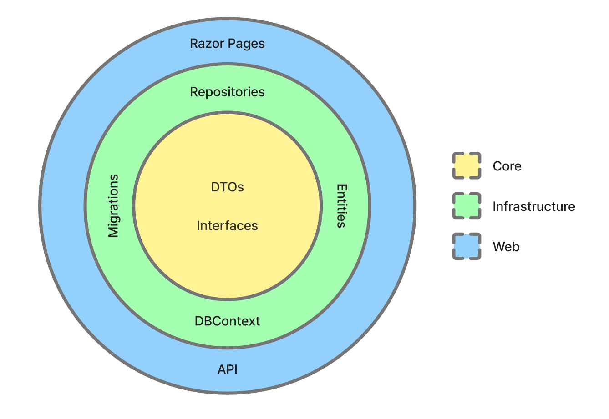
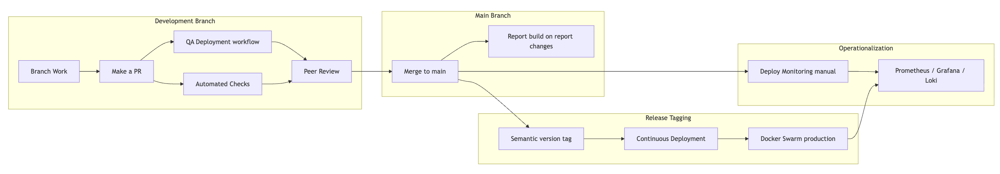
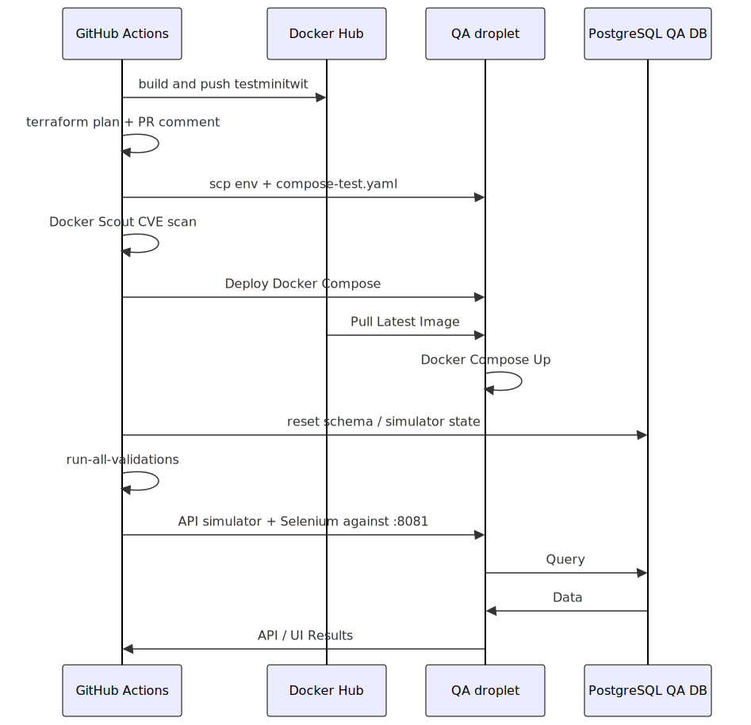
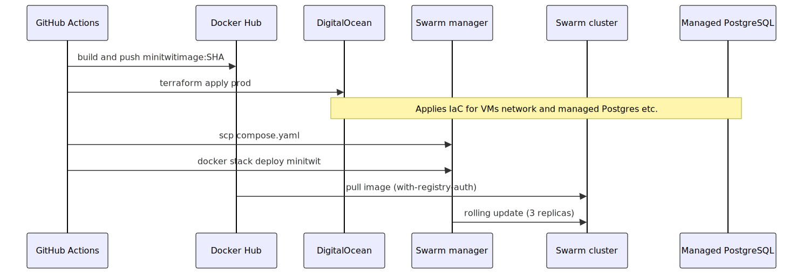
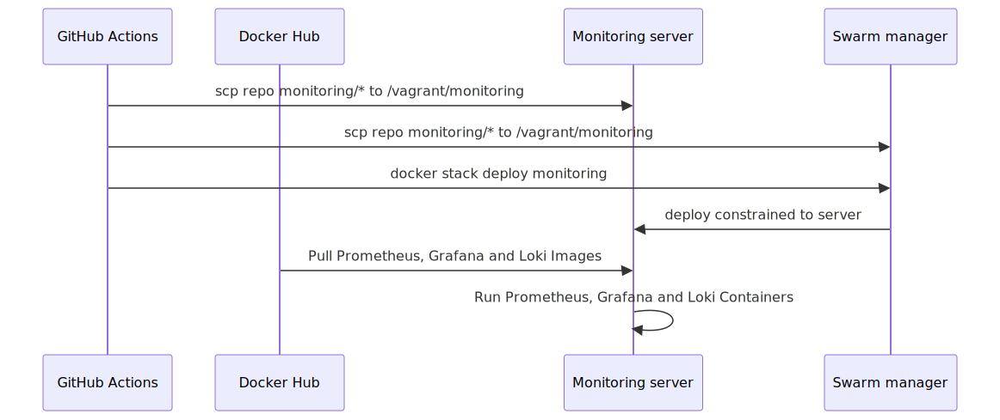
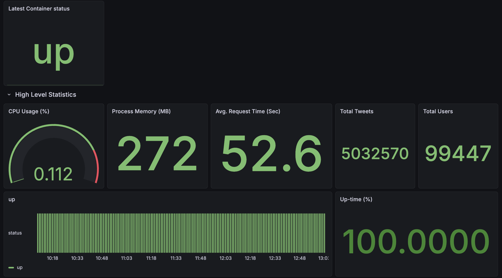
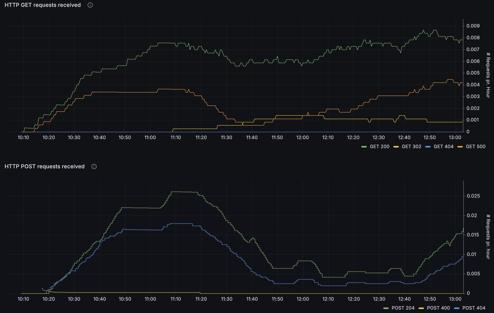
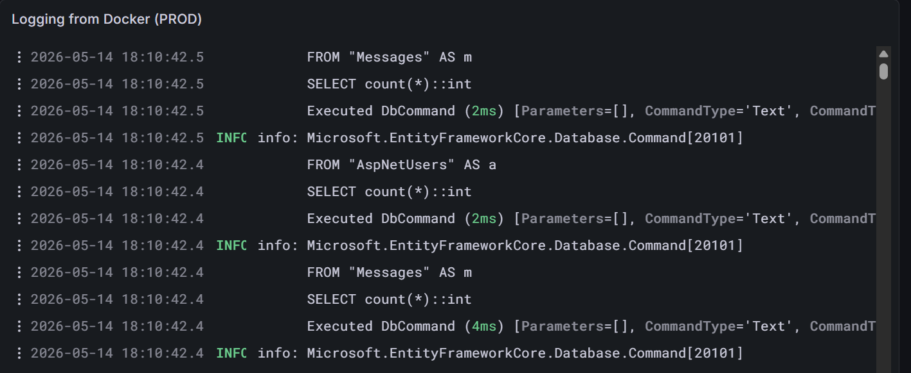
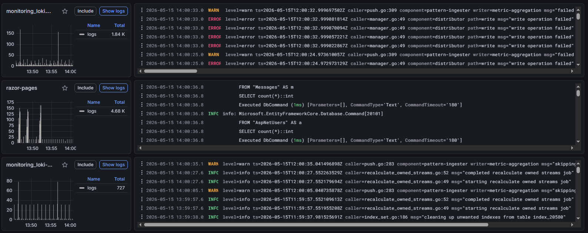
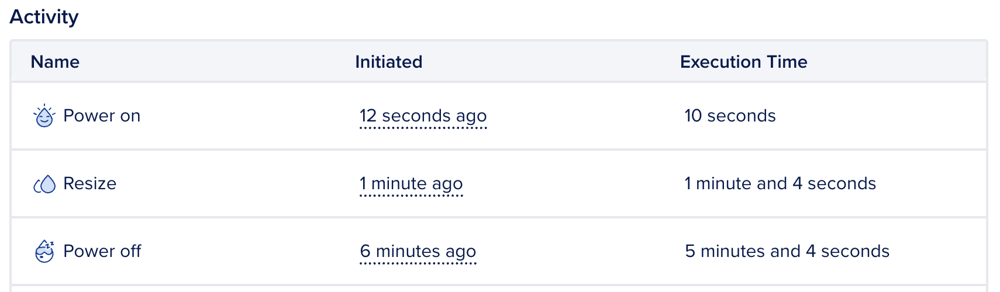

# Report

## 1. System's Perspective

### 1.1 Design and Architecture
When tasked with switching to another language for the system, C# was chosen. Accordingly, the project was built with Razor Pages and Entity Framework Core. The choice of C# was due to much of the group's pre-existing familiarity with the language, which streamlined the development process, especially when it came to the architecture.

The architecture of the project follows a layered onion architecture split into three parts: Core, Infrastructure, and Web. The below visualization shows the responsibilities of each layer:

- The Core layer of the system focuses on handling DTOs and repository interfaces. This layer does not reference any frameworks or libraries, staying independent from the rest of the system.
- The Infrastructure layer focuses on the database context, migrations, and the implementation of repository interfaces. This layer depends only on the Core, whilst having no reference to the Web layer.
- The Web layer handles the UI through Razor Pages along with the API. It also acts as the base of the system, handling the dependency injection and referencing both the Core and Infrastructure layers of the application.

#### 1.1.1 Choice of Final Infrastructure-as-Code Architecture
We ended up migrating to Terraform towards the end of the project as it allowed for easy maintenance and resource control through defined interfaces. Terraform has a thoroughly defined Documentation for Digital Ocean resources, and the migration to defining existing Vagrant deployments along with "Click-Ops" resources therefore did not have much extra overhead.

### 1.2 Dependencies of MiniTwit

- **Git / GitHub** *(Development, CI/CD)* Source control, reviews, and workflow hosting
- **Trello** *(Development, operations)* Backlog management and work tracking
- **Discord** *(Development, operations)* Team communication and receiving alerts (for example from GitHub & Grafana webhooks)
- **C# / .NET** *(Development, production)* Application language and runtime
- **NuGet** *(Development, CI/CD)* Package restore and feeds for .NET dependencies
- **ASP.NET Core (Razor Pages)** *(Development, production)* Web UI and HTTP API
- **Entity Framework Core** *(Development, production)* Database access and migrations
- **PostgreSQL** *(Development, testing, production)* Primary data store (managed in DigitalOcean)
- **Docker** *(Development, CI/CD, production)* Container images and runtime isolation
- **Docker Hub** *(CI/CD, production)* Registry for built application images
- **Docker Compose** *(Development, testing)* Local and test multi-container setups
- **Docker Swarm** *(Production)* Orchestration and rolling updates
- **DigitalOcean** *(Infrastructure, production)* Cloud VMs, managed database, and networking
- **DigitalOcean Spaces (S3-compatible)** *(Infrastructure, CI/CD)* Object storage with an S3-compatible API (Terraform remote state backend)
- **Terraform** *(Infrastructure, CI/CD)* Infrastructure as code for managing cloud resources
- **GitHub Actions** *(CI/CD)* Continuous integration and deployment pipelines
- **Third-party GitHub Actions** *(CI/CD)* Marketplace and vendor-maintained workflow steps (for example checkout, Docker login, Terraform setup, PR plan commenter, GitHub App token)
- **GitHub CLI** *(CI/CD)* Command-line GitHub integration in workflows (for example `gh auth setup-git` for automated commits)
- **Ubuntu** *(CI/CD, production)* Base operating system on GitHub-hosted runners and provisioned droplets
- **SSH (OpenSSH)** *(CI/CD, production)* Remote deploy, file copy, and server access from pipelines
- **Prometheus** *(Monitoring)* Metrics collection
- **Grafana** *(Monitoring)* Dashboards and alerting
- **Loki** *(Monitoring)* Centralized log storage
- **Promtail** *(Monitoring)* Shipping container logs to Loki
- **Python** *(Testing (local and CI/CD))* API simulator test driver and test scripts
- **Selenium** *(Testing (local and CI/CD))* Browser-based UI tests (with Chrome in Docker)
- **dotnet format** *(Development, CI/CD)* C# formatting and verifying the tree matches the formatter in CI
- **Roslynator** *(Development, CI/CD)* C# static analysis (Roslyn-based diagnostics)
- **Codespell** *(Development, CI/CD)* Spell checking across the repository
- **Hadolint** *(Development, CI/CD)* Linting Dockerfiles
- **Codacy** *(Development, CI/CD)* Hosted static analysis and pull-request quality checks
- **SonarCloud** *(Development, CI/CD)* SonarQube-family analysis and quality gate on pull requests
- **CodeQL** *(Development, CI/CD)* Semantic security and quality scanning (for example C# and Python) on pull requests
- **Docker Scout** *(CI/CD)* Container image vulnerability scanning on QA builds
- **OpenAPI Generator** *(Development)* Generating the API simulator stub from the OpenAPI description
- **Pandoc** *(Report CI/CD)* Converting the report Markdown to PDF in automation
- **LaTeX (pdflatex / TeX Live)** *(Report CI/CD)* PDF engine used by Pandoc for report builds
- **librsvg (rsvg-convert)** *(Report CI/CD)* Converting committed SVG figures (for example Mermaid diagrams) for inclusion in the PDF
- **GNU Make** *(Development, CI/CD)* Task automation (local and in workflows)

#### Libraries

NuGet references come from the Razor Pages solution (`razor-pages/Web`, `razor-pages/Infrastructure`). Direct Python libraries for automated tests are listed below; the UI test lockfile also pins transitive versions (see `tests/selenium/requirements.txt`).

- **Microsoft.AspNetCore.Identity.EntityFrameworkCore** *(Web, Infrastructure)* ASP.NET Core Identity integrated with EF Core
- **Microsoft.EntityFrameworkCore.Design** *(Web, Infrastructure)* EF Core design-time support and migrations
- **Npgsql.EntityFrameworkCore.PostgreSQL** *(Web, Infrastructure)* EF Core provider for PostgreSQL
- **Newtonsoft.Json** *(Web)* JSON serialization and deserialization
- **Swashbuckle.AspNetCore.Annotations** *(Web)* OpenAPI metadata and attributes for the HTTP API
- **Swashbuckle.AspNetCore.Newtonsoft** *(Web)* OpenAPI generation using Newtonsoft.Json
- **DotNetEnv** *(Web)* Loading environment variables from `.env` files
- **prometheus-net.AspNetCore** *(Web)* Prometheus metrics for ASP.NET Core
- **Microsoft.CodeAnalysis.Analyzers** *(Infrastructure)* Build-time Roslyn analyzers
- **Microsoft.Extensions.Hosting** *(Infrastructure)* Hosting abstractions for background-style infrastructure code
- **prometheus-net** *(Infrastructure)* Prometheus metric registration and exposition primitives
- **Npgsql** *(Infrastructure)* PostgreSQL data provider (ADO.NET) alongside EF
- **TimeZoneConverter** *(Infrastructure)* Resolving time zones in infrastructure logic
- **requests** *(tests/API_Spec)* HTTP calls from the API simulator
- **pytest** *(tests/selenium)* Test runner for the Selenium UI suite
- **selenium** *(tests/selenium)* WebDriver client driving the remote Chrome grid

### 1.3 Current State of Our Systems
The current state of our system leaves it steadily functional across performance, scalability, code quality, security, and testing. However, there are still some limiting factors that should be dealt with prior to considering it a complete product. 

In regards to performance and scalability, the primary issue we encountered is the resources available to the server being insufficient for exceptionally high traffic. However, this was mainly attributed to the DigitalOcean server plan tier we used rather than a structural limitation of the application itself. 

The test coverage is fairly extensive across the API and browser-based UI levels, but there could be more explicit tests for base application logic, as well as error and edge-case interactions and security behavior. 

#### Static Analysis and Code Quality Tools
- **SonarQube** indicates a few potential reliability and maintainability issues, as well as some security hotspots, but still gives it an A-rating in the main issue categories. 
- **Codacy** gives the application as a whole an A-rating, but also indicates a few potential security hotspots.
- **CodeQL** passes on all its vulnerability checks.
- **Hadolint** and **Roslynator** show no issues.

**SonarQube's Quality Assessment:**

The issues mainly consist of maintainability and style problems, such as inconsistent naming, improper exception handling, and potential accessibility and configuration problems. Additionally, there are a few issues involving some incomplete implementations and asynchronicity handling. 

## 2. Process' perspective

### 2.1 CI/CD pipelines, deployment, and release

All development work is done on branches and requires a pull request to be merged into the main branch.
Pull requests are automatically checked with code scanning tools and also triggers a QA build which runs a full build, test and deployment to a QA droplet and database. 
Note that due to limitations on number of allowed droplets in our Digital Ocean account level, this QA droplet was later included in the production swarm as well.

After merging a pull request into main, the report pdf is built if changes have been made in the relevant files.
Nothing is immediately pushed to production as we deemed that we wanted our releases to contain more than a single small change, as well as to have more control of when releases to production were made.
The control of timing is important to ensure stability of the application and timely action given a failure/bug.

We used an automated pipeline to deploy our production services that automatically triggers when a tag is pushed to the repository.
We attempted to follow a form of semantic versioning ([https://semver.org/](https://semver.org/)) for tag names in order to have a consistent format and a notion of how big each release was.
The automated deployment builds a docker image and deploys the stack on the swarm leader node.

Monitoring is deployed manually in a separate workflow. The monitoring droplet was initially a stand-alone droplet, but given the Digital Ocean limitation on droplets, this droplet was also later included in the swarm. 
The monitoring deployment could have been automatically deployed if changes appeared in the relevant root folder, yet changes to the configurations were rather rare and we therefore did not deem it necessary.

Below is an overview of the different stages of development towards operationalization. In the following sections we will deep dive into the QA deployment workflow, continuous deployment release workflow, and the monitoring deployment workflow.

#### Pull-request pipeline (QA Deployment)

The QA deployment is defined in [.github/workflows/continous-QA-deployment.yaml](https://github.com/TienCamLy/MiniTwit/blob/main/.github/workflows/continous-QA-deployment.yaml) and is automatically run on pull requests towards the main branch.

The above flowchart shows the various steps and interactions between systems happening during the QA Deployment and test workflow. The workflow runs at the same time as the static code analysis tools: `CodeQL`, `SonarCube`, and `Codacy`. 

#### Production release (Continuous Deployment)

The Continuous deployment to production is defined in [.github/workflows/continous-deployment.yaml](https://github.com/TienCamLy/MiniTwit/blob/main/.github/workflows/continous-deployment.yaml) and is automatically run on tags pushed to the main branch.

#### Monitoring deployment

The monitoring stack deployment is defined in [.github/workflows/monitor-deployment.yaml](https://github.com/TienCamLy/MiniTwit/blob/main/.github/workflows/monitor-deployment.yaml) and runs only when someone manually triggers it.

#### Deployment & Release Summary

- **Local** *(via `make app-build` — `compose-test.yaml`, port 8081)* Using Local Docker Compose
- **QA (pre-merge)** *(QA Deployment workflow on pull request)* With Docker Hub image `testminitwit:latest`, Using Compose on test droplet
- **Production** *(tag, then Continuous Deployment)* With Docker Hub image `minitwitimage:<sha>`, Using Docker Swarm (3 replicas)
- **Monitoring** *(manual Deploy Monitoring workflow)* Using Swarm stack `monitoring`

### 2.2 Monitoring
The monitoring of our application is done through the use of Prometheus and Grafana. 

The data collection is handled by Prometheus' .NET client library, prometheus-net, where UseMetricServer collects and exposes metrics for use by Grafana. Additional http request metrics are collected through the use of the UseHttpMetrics middleware provided by Prometheus. Custom metric gatherers were also implemented to retrieve metrics from the application's database. 

Grafana then retrieves these exposed metrics provided by Prometheus and allows for the construction of various visualizations. We also implemented a Grafana alert based on the up-time metric to inform us when the server was down.

#### Monitoring Panels
- Current and uptime of container status
- CPU utilization
- Memory utilized by dotnet processes, as well as total physical allocated memory
- Total tweets and tweet rate
- Total users and registration rate
- Http request response latency by their action
- Http GET and POST request rates over time by their response status codes

#### Example Visuals:

### 2.3 Aggregated logs
All assignment completions for each week have been aggregated in [View project log](https://github.com/TienCamLy/MiniTwit/blob/main/log.md). It was standard practice for everyone to document which tasks they completed.
A type of "Meta" log used is the [README file](https://github.com/TienCamLy/MiniTwit/blob/main/README.md); it serves as how we ought to implement the assignments as well as principles on how work as a group.
Docker has a built-in log system for each droplet. This logging system was rarely used except for some debugging cases.
All live logs are shipped to Grafana.

Dedicated logging section of Grafana:

### 2.4 Security Hardening
For the security hardening of our system a security assessment was made showing an overview of assets, threats, and risks:

**Assets**
- Web Application & API Endpoint
- PostgreSQL Database
- Monitoring (Grafana, Loki, Promtail & Prometheus)

**Threat Sources**
- SQL Injection
- Cross-Site Scripting (XSS)
- DDoS Attack
- Brute force attack

**Risk Scenarios**
- An attacker uses SQL injection on the web application to gain access to the database.
- An attacker injects a script into a post, which is executed on other users’ browsers, allowing the attacker to steal session tokens.
- An attacker uses a script to spam an API endpoint, resulting in a denial of service.

**Risk Analysis**

| Scenario                   | Likelihood      | Impact | Risk     |
|:--------------------------:|:---------------:|:------:|:--------:|
| SQL Injection              | High/Common     | High   | Critical |
| Cross-Site Scripting (XSS) | High/Common     | High   | High     |
| DDoS Attack                | Medium/Uncommon | Medium | Medium   |

To solve the various risk scenarios the following measures were taken:
- SQL Injection: All inputs are sanitized to avoid script injection. This is handled automatically by Entity Framework Core.
- Cross-Site Scripting (XSS): This gains from the input sanitation, but still needs an output encoding to ensure data is rendered as text. Which is handled by Razor Pages rendering all posts as plain text.
- DDoS Attack: Access is restricted to only allow a certain amount of requests per/minute, to minimize the effect of DDoS attacks.

**Other Security Measures**
- Setting up inbound firewall rules on DigitalOcean and utilizing `ufw` on the server only allowing specific traffic through on specified ports. Docker does not bypass DigitalOcean's firewalls. 

The production application was given firewall rules for:
- Standard internet and access ports (TCP 22, TCP 80, TCP 443)
- Docker port (TCP 2376)
- Docker Swarm infrastructure ports (TCP 2377, UDP 4789, TCP/UDP 7946)
- Application ports (TCP 8080)
- Grafana Loki log aggregation port (TCP 3100)
- Prometheus ports (TCP 9090, TCP 9095, TCP 9096, TCP 9100)

Other security measures were also taken such as:

- Ensuring the application runs on HTTPS with a TLS certificate and setting up `Nginx` for a reverse proxy in front of the application.
- Docker images were also hardened for security by ensuring only user privileges.
- Setting CodeQL up in the repository to scan the code for security vulnerabilities. The static analysis tool automatically discovers source code languages in the repository and dynamically adjusts the scan based on the languages present. CodeQL analyzes the following files in the repository:
  - C# files
  - Python files
  - GitHub Action files
- A Docker image vulnerability scanner, Docker Scout, has been added to the CI workflow to ensure any image vulnerabilities are detected before deployment. 

### 2.5 Availability and Scaling
Availability and scaling in the MiniTwit application are managed by Docker Swarm. A Swarm cluster of the DigitalOcean Droplets is joined into a single Swarm cluster,
which continuously monitors and enforces the desired state.

**High availability** is handled by having manager redundancy, three production container replicas, and automatic self-healing. 
All three nodes in the cluster are given the `manager` role to prevent a single point of failure if one of the manager nodes fails. 
When a node in the cluster crashes, the Swarm detects a difference between the actual state and the declared desired state, such that 
the number of actual running replicas is lower than three, which triggers *self-healing* to restore the third replica. 

**Scaling** is handled by Docker Swarm's built-in Ingress Routing Mesh, which functions as a load balancer. 
Swarm evenly distributes incoming user requests across all three healthy replicas of the production container to handle high amounts of concurrent requests. 
This parallelizes the workload across the nodes, such that a container does not consume all the resources of a single node.

To ensure low downtime during the transition from the standalone containers to a Docker Swarm cluster, 
the stack was deployed with a **blue-green service deployment** strategy from the start, such that the running containers were gradually replaced by the updated ones. 
This is achieved by configuring the deployment settings within the Docker Compose file to set the update order to `start-first` and 
a delay parameter that dictates how long Docker Swarm should wait after starting an updated container before terminating an old one, 
allowing the new container to initialize.

As a result, the services remain available during deployment. By default, Docker Swarm uses the rolling update strategy which terminates the old container 
before starting a new one. This is referred to as `stop-first`. By terminating the containers first, the default strategy forces the application to experience downtime 
during the window between container termination and container initialization.

While our strategy should have ensured low downtime during the transition to Docker Swarm, the production application still experienced downtime 
due to overlooked human errors. These errors came as a result of debugging separate Docker Swarm migration issues. 
Specifically, the Swarm Ingress routing mesh overwrote the port of the development environment on one of our DigitalOcean Droplets, 
and the Loki logs failed to display on our Grafana dashboards. During the debugging process, accidental downtime of the application was introduced 
when pulling the wrong container image due to misconfigured environment secrets, or changing the application to use another port, 
which prevented the simulator from reaching it. 

To avoid these issues in the future, a solution could be to replicate the Docker Swarm infrastructure 
within an isolated development environment, so any configuration changes during the transition does not affect live production. 

## 3. Reflection Perspective

### 3.1 Evolution and Refactoring
On first refactoring from Python to RazorPages with C# we ran into unforeseen issues with the methods not working as intended. This slowed us down but once the bugs were solved we were able to make our release.
We had no issues Refactoring to our Onion Structure. It was time-consuming, but half the group being familiar with the framework made the process smooth.

We discussed that it may have been useful to have defined the infrastructure in Terraform from the beginning and that it may have led us to avoid having the amount of "Click-Ops" we had during the project (setting up a managed database, modifying network rules for droplets etc.), giving better reproducibility and version history.

### 3.2 Operation

To increase robustness, we added a QA deployment on Pull Requests, requiring the application to be built, pushed, and tests to have passed before merging it into the main branch. This allowed us to test all of our features fully before releasing them to our main application, thereby decreasing the amount of bugs and operational work.

In early April we started receiving warnings from the built-in resource alert system in Digital Ocean that our Database Cluster was above 90% CPU utilization. We started investigating the issue and realized that the amount of requests coming in had ramped up so much that our database could not follow along.
We chose to resize the cluster such that it had an extra virtual CPU after cost-benefit analysis concluding that the developer time it would take to improve the ORM system to send fewer requests would be too time consuming versus the cost of upgrading the database cluster.
The database was resized with no downtime.

Once we had fully migrated to swarm, including log shipping from all our droplets, the droplet containing the monitoring application ended up being overloaded such that our monitoring application became unreachable. This warranted an upgrade of the droplet containing the monitoring application. If we had access to spin up more droplets, we may have considered horizontal scaling instead of vertical.
The monitoring droplet was resized using terraform and therefore had minimal possible downtime. The full process took ~6 minutes:

We struggled with the continuous deployment of our monitoring application in terms of ensuring new dashboards would appear and an unintended addition of a flag that reset the volumes for Loki and Prometheus. After realizing the issue and looking at a few different combinations of flags, we fixed the issues and accepted the loss of earlier metrics & logs.

An improvement of the monitoring deployment would be to trigger it on changes to the particular folder containing monitoring definitions instead of only manual triggers.

### 3.3 Maintenance

## 4. Use of Generative AI

The generative AI tool Cursor ([https://cursor.com/](https://cursor.com/)) was used to discuss issues and warnings throughout the project and provide guidance on issues that we had not encountered before. This was beneficial to the development process as it unblocked us in completing tasks.
We used Cursor to improve the code in terms of maintainability by standardizing the format and structure along with industry standard formatting / linting tools (i.e. using a mix of CLI tools and GenAI).
We also employed Cursor to summarize branch work in our log.md and other documentation, to ensure chore tasks were being done rather than neglected. These logs and documentation are used to remind us of the work and considerations throughout the different stages of the project which have been written / read for internal use.

Claude and ChatGPT were used to quickly bounce ideas off of and to help identify the pros/cons of options when many were presented. Additionally, they were very useful in quickly parsing large error logs. 

ChatGPT ([https://chatgpt.com/](https://chatgpt.com/)) was used for debugging GitHub Actions, Docker, and DevOps setup issues, it often hindered our work on the Deployment workflows but helped significantly on Command lines in the terminal.

The AI tool GitHub Copilot was used throughout the course for better code understanding, serving as interactive documentation. It was also used for very specific code fixes, usually hinted by SonarQube, such as `b6f71cf3242a25a0c03cd0c0763040417532838f - add wheel hashes to the requirements file`. This made it possible to implement security and maintainability solutions that sometimes felt like an overkill.

When it came to the use of GAI, ChatGPT, and GitHub Copilot were used to better understand coding errors and thereby helping in solving them.
Another aspect of using AI was quickly learning how to do specific things in different languages. 
For example "How do i write inline code in .md?" or "How do I change the rejection status code on the rate limiter?".

The **Google Gemini 3 model** has primarily been used for debugging and to resolve technical uncertainty during development. 

This includes asking the generative AI model to: 
- find possible fixes for errors, as well as explaining how and why they appeared. 
- provide an overview and understanding of important features and commands of new tools and technologies. 
- review developer decisions to ensure that any changes to the application is correct.
- check for grammar and phrasings when writing documentation or report.
