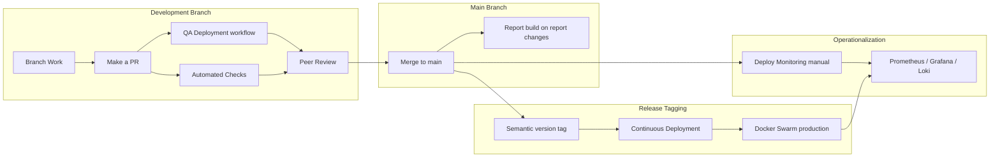
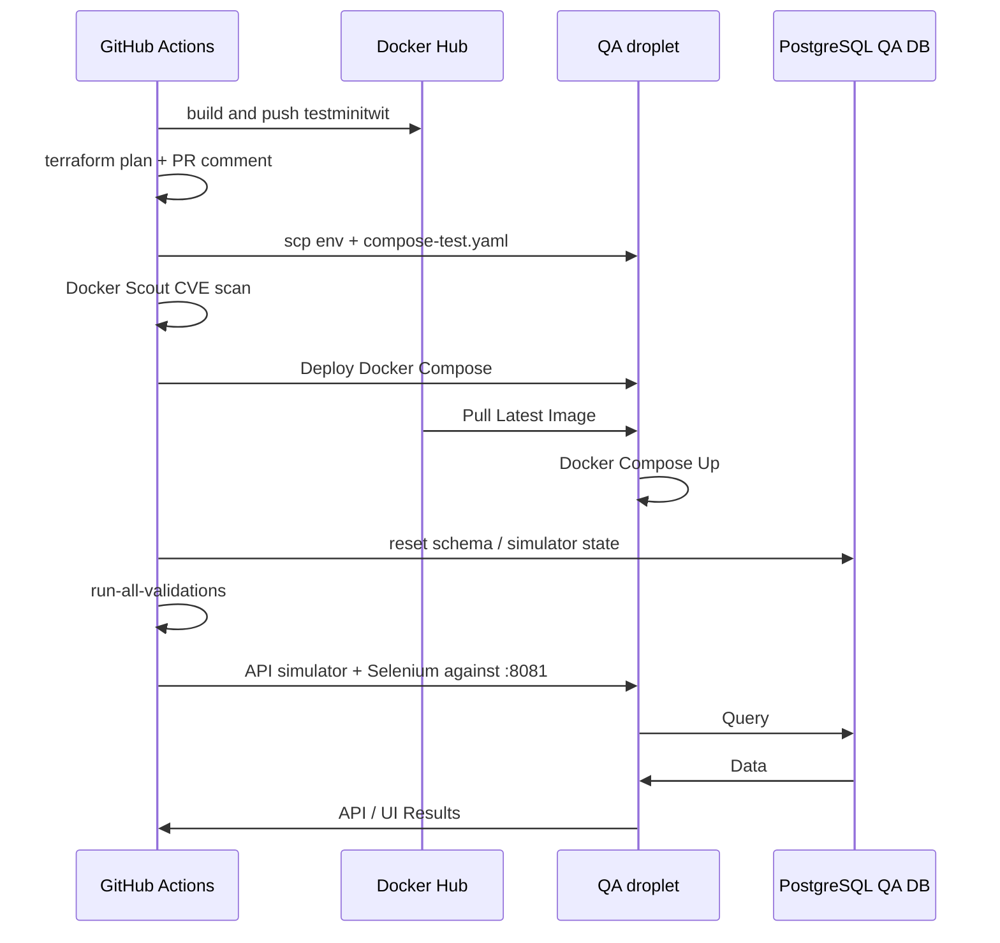
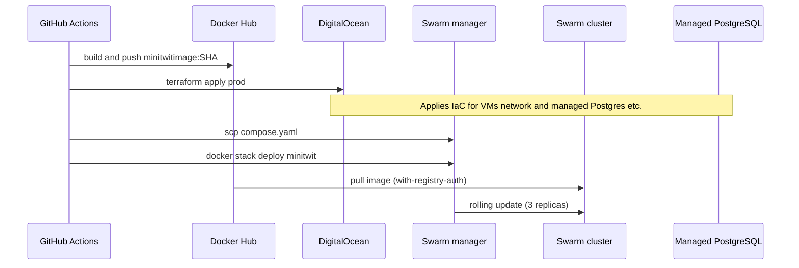
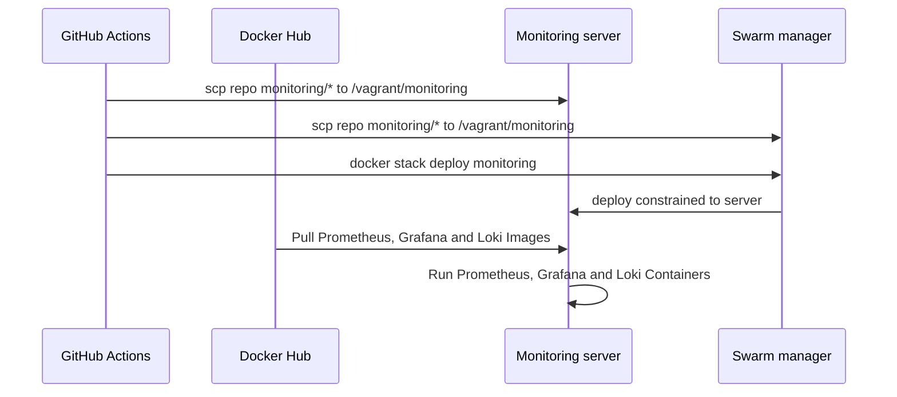

# Report

## 1. System's Perspective

<!--- A description and illustration of the: -->

<!--- Design and architecture of your ITU-MiniTwit systems. -->
### 1.1

<!--- All dependencies of your ITU-MiniTwit systems on all levels of abstraction and development stages. That is, list and briefly describe all technologies and tools you applied and depend on. -->
### 1.2 Dependencies of MiniTwit

| Technology | Stage | Role |
|------------|-------|------|
| Git / GitHub | Development, CI/CD | Source control, reviews, and workflow hosting |
| Trello | Development, operations | Backlog management and work tracking |
| Discord | Development, operations | Team communication and receiving alerts (for example from GitHub & Grafana webhooks) |
| C# / .NET | Development, production | Application language and runtime |
| NuGet | Development, CI/CD | Package restore and feeds for .NET dependencies |
| ASP.NET Core (Razor Pages) | Development, production | Web UI and HTTP API |
| Entity Framework Core | Development, production | Database access and migrations |
| PostgreSQL | Development, testing, production | Primary data store (managed in DigitalOcean) |
| Docker | Development, CI/CD, production | Container images and runtime isolation |
| Docker Hub | CI/CD, production | Registry for built application images |
| Docker Compose | Development, testing | Local and test multi-container setups |
| Docker Swarm | Production | Orchestration and rolling updates |
| DigitalOcean | Infrastructure, production | Cloud VMs, managed database, and networking |
| DigitalOcean Spaces (S3-compatible) | Infrastructure, CI/CD | Object storage with an S3-compatible API (Terraform remote state backend) |
| Terraform | Infrastructure, CI/CD | Infrastructure as code for managing cloud resources |
| GitHub Actions | CI/CD | Continuous integration and deployment pipelines |
| Third-party GitHub Actions | CI/CD | Marketplace and vendor-maintained workflow steps (for example checkout, Docker login, Terraform setup, PR plan commenter, GitHub App token) |
| GitHub CLI | CI/CD | Command-line GitHub integration in workflows (for example `gh auth setup-git` for automated commits) |
| Ubuntu | CI/CD, production | Base operating system on GitHub-hosted runners and provisioned droplets |
| SSH (OpenSSH) | CI/CD, production | Remote deploy, file copy, and server access from pipelines |
| Prometheus | Monitoring | Metrics collection |
| Grafana | Monitoring | Dashboards and alerting |
| Loki | Monitoring | Centralized log storage |
| Promtail | Monitoring | Shipping container logs to Loki |
| Python | Testing (local and CI/CD) | API simulator test driver and test scripts |
| Selenium | Testing (local and CI/CD) | Browser-based UI tests (with Chrome in Docker) |
| dotnet format | Development, CI/CD | C# formatting and verifying the tree matches the formatter in CI |
| Roslynator | Development, CI/CD | C# static analysis (Roslyn-based diagnostics) |
| Codespell | Development, CI/CD | Spell checking across the repository |
| Hadolint | Development, CI/CD | Linting Dockerfiles |
| Codacy | Development, CI/CD | Hosted static analysis and pull-request quality checks |
| SonarCloud | Development, CI/CD | SonarQube-family analysis and quality gate on pull requests |
| CodeQL | Development, CI/CD | Semantic security and quality scanning (for example C# and Python) on pull requests |
| Docker Scout | CI/CD | Container image vulnerability scanning on QA builds |
| OpenAPI Generator | Development | Generating the API simulator stub from the OpenAPI description |
| Pandoc / LaTeX | CI/CD | Building the report PDF in automation |
| GNU Make | Development, CI/CD | Task automation (local and in workflows) |

#### Libraries

NuGet references come from the Razor Pages solution (`razor-pages/Web`, `razor-pages/Infrastructure`). Direct Python libraries for automated tests are listed below; the UI test lockfile also pins transitive versions (see `tests/selenium/requirements.txt`).

| Library | Context | Usage |
|---------|---------|-------|
| Microsoft.AspNetCore.Identity.EntityFrameworkCore | Web, Infrastructure | ASP.NET Core Identity integrated with EF Core |
| Microsoft.EntityFrameworkCore.Design | Web, Infrastructure | EF Core design-time support and migrations |
| Npgsql.EntityFrameworkCore.PostgreSQL | Web, Infrastructure | EF Core provider for PostgreSQL |
| Newtonsoft.Json | Web | JSON serialization and deserialization |
| Swashbuckle.AspNetCore.Annotations | Web | OpenAPI metadata and attributes for the HTTP API |
| Swashbuckle.AspNetCore.Newtonsoft | Web | OpenAPI generation using Newtonsoft.Json |
| DotNetEnv | Web | Loading environment variables from `.env` files |
| prometheus-net.AspNetCore | Web | Prometheus metrics for ASP.NET Core |
| Microsoft.CodeAnalysis.Analyzers | Infrastructure | Build-time Roslyn analyzers |
| Microsoft.Extensions.Hosting | Infrastructure | Hosting abstractions for background-style infrastructure code |
| prometheus-net | Infrastructure | Prometheus metric registration and exposition primitives |
| Npgsql | Infrastructure | PostgreSQL data provider (ADO.NET) alongside EF |
| TimeZoneConverter | Infrastructure | Resolving time zones in infrastructure logic |
| requests | tests/API_Spec | HTTP calls from the API simulator |
| pytest | tests/selenium | Test runner for the Selenium UI suite |
| selenium | tests/selenium | WebDriver client driving the remote Chrome grid |

<!--- Describe the current state of your systems, for example using results of static analysis and quality assessments. -->
### 1.3

## 2. Process' perspective
<!--- 
This perspective should clarify how code or other artifacts come from idea into the running system and everything that happens on the way.
In particular, the following descriptions should be included: -->

<!--- A complete description and illustration of stages and tools included in the CI/CD pipelines, including deployment and release of your systems. -->
### 2.1 CI/CD pipelines, deployment, and release

All development work is done on branches and requires a pull request to be merged into the main branch.
Pull Requests are automatically checked with code scanning tools and also triggers a QA build which runs a full build, test and deployment to a QA droplet and database. 
Note, that due to limitations on number of allowed droplets in our Digital Ocean account level, this QA droplet was later included in the production swarm as well.

After merging a pull request into main, the report pdf is built iff changes have been made in the relevant files.
Nothing is immediately pushed to production as we deemed that we wanted our releases to contain more than a single small change and have more control of when releases to production were made.
The control of timing is important to ensure stability of the application and timely action given a failure/bug.

We used an automated deployment pipeline to deploy our production services that automatically triggers when a tag is pushed to the repository.
We attempted to follow a form of [semantic versioning](https://semver.org/) for tag names, to have a consistent format and a notion of how big each release was.
The automated deployment builds a docker image and deploys the stack on the swarm leader node.

Monitoring is deployed manually in a separate workflow. The monitoring droplet was initially a stand-alone droplet, but given the Digital Ocean limitation on droplets, this droplet was also later included in the swarm. 
The monitoring deployment could have been automatically deployed if changes appeared in the relevant root folder, yet changes to the configurations were rather rare and we therefore did not find it necessary.

Below is an overview of the different stages of development towards operationalization. In the following sections we will deep dive into the QA deployment workflow, continuous deployment release workflow and the monitoring deployment workflow.

#### Pull-request pipeline (QA Deployment)

The QA deployment is defined in [.github/workflows/continous-QA-deployment.yaml](../.github/workflows/continous-QA-deployment.yaml) and is automatically run on pull requests towards the main branch.

Above flow chart shows the various steps and interactions between systems happening during the QA Deployment and test workflow. The workflow runs at the same time as the static code analysis tools `CodeQL`, `SonarCube` and `Codacy`. 

#### Production release (Continuous Deployment)

The Continuous deployment to production is defined in [.github/workflows/continous-deployment.yaml](../.github/workflows/continous-deployment.yaml) and is automatically run on tags pushed to the main branch.

#### Monitoring deployment

The monitoring stack deployment is defined in [.github/workflows/monitor-deployment.yaml](../.github/workflows/monitor-deployment.yaml) and runs only when someone manually triggers it.

#### Deployment & Release Summary

| Environment | How it is updated | Image / orchestration |
|-------------|-------------------|------------------------|
| Local | `make app-build` (`compose-test.yaml`, port 8081) | Local Docker Compose |
| QA (pre-merge) | QA Deployment workflow on PR | `testminitwit:latest`, Compose on test droplet |
| Production | Tag → Continuous Deployment | `minitwitimage:<sha>`, Docker Swarm (3 replicas) |
| Monitoring | Manual Deploy Monitoring workflow | Swarm stack `monitoring` |

<!--- How do you monitor your systems and what precisely do you monitor? -->
### 2.2

<!--- What do you log in your systems and how do you aggregate logs? -->
### 2.3 Aggregated logs
All assignment completions for each week have been aggregated in [View project log](../log.md)
. It was standard practice for everyone to document which tasks they completed.
A type of "Meta" log used is the [README file](../README.md) it serves as how we ought to implement the assignments as well as principle on how work as a group
Docker has a built-in log system for each droplet. This logging system was rarely used except for some debugging cases.
all live logs are shipped to grafana 

<!--- Brief description of how you security hardened your systems. -->
### 2.4

<!--- How do you handle availability and scaling in your systems? -->
### 2.5 Availability and Scaling
Availability and scaling in the MiniTwit application are managed by Docker Swarm. A Swarm cluster of the DigitalOcean Droplets is joined into a single Swarm cluster,
which continuously monitors and enforces the declared desired state.

**High availability** is handled by having manager redundancy, three production container replicas, and automatic self-healing. 
All three nodes in the cluster are given the `manager` role to prevent a single point of failure if one of the manager nodes crashes. 
When a node in the cluster crashes, the Swarm detects a difference between the actual state and the declared desired state, such that 
the number of actual running replicas is lower than three, which triggers *self-healing* to restore the third replica. 

**Scaling** is handled by Docker Swarm's built-in Ingress Routing Mesh which functions as a load balancer. 
Swarm evenly distributes incoming user requests across all three healthy replicas of the production container to handle high amounts of concurrent requests. 
This parallelizes the workload across the nodes, such that a container does not consume all the resources of a single node.

To ensure low downtime during the transition from the standalone containers to a Docker Swarm cluster, 
the stack was deployed with a **blue-green service deployment** strategy from the start, such that the running containers were gradually replaced by the updated ones. 
This is achieved by configuring the deployment settings within the Docker Compose file to set the update order to `start-first` and 
a delay parameter that dictates how long Docker Swarm should wait after starting an updated container before terminating an old one, 
allowing the new container to initialize.

As a result, the services remain available during deployment. By default, Docker Swarm uses the rolling update strategy which terminates the old container 
before starting a new one. This is called `stop-first`. By terminating the containers first, the default strategy forces the application to experience downtime 
during the window between container termination and container initialization.

While our strategy should have ensured low downtime during the transition to Docker Swarm, the production application still experienced downtime 
due to overlooked human errors. These errors came as a result of debugging separate Docker Swarm migration issues. 
Specifically, the Swarm Ingress routing mesh overwrote the port of the development environment on one of our DigitalOcean Droplets, 
and the Loki logs failed to display on our Grafana dashboards. During the debugging process, accidental downtime of the application was introduced 
when pulling the wrong container image due to misconfigured environment secrets, or changing the application to use another port, 
which prevented the simulator from reaching it. 

<!--- Move to reflection part? -->
To avoid these issues in the future, a solution could be to replicate the Docker Swarm infrastructure 
within an isolated development environment, so any configuration changes during the transition does not affect live production. 

## 3. Reflection Perspective

<!--- Describe the biggest issues, how you solved them, and which are major lessons learned with regards to: evolution and refactoring, operation, and maintenance 

of your ITU-MiniTwit systems. Link back to respective commit messages, issues, tickets, etc. to illustrate these.

Also reflect and describe what was the "DevOps" style of your work. For example, what did you do differently to previous development projects and how did it work?
-->

<!--- evolution and refactoring -->
### 3.1 Evolution and Refactoring
On first refactoring from Pyhton to RazorPages with C# we ran into unforseen issues with the methods not working as intended. This slowed us down but once the bugs were solved we were able to make our release.
We had no issues Refactoring to our Onion Structure. It was time-consuming but that half the group being familiar with the framework made the proces smooth.
<!--- operation -->
### 3.2 Operation

<!--- maintenance -->
### 3.3 Maintenance

## 4. Use of Generative AI
<!---
ITU's rules on the use of generative AI apply for this report too. They are described here and in detail here. 
Please follow them. For your report that means that you have to state which generative AI tools have been used for which task(s) in your projects. 
Additionally, describe how generative AI tools have been used and briefly reflect and discuss how they supported or hindered your work process.
-->

<!--- Mie -->
The generative AI tool [Cursor](https://cursor.com/) was used to discuss issues and warnings throughout the project and provide guidance on issues that we had not encountered before. This was beneficial to the development process as it unblocked us in completing tasks.
We used Cursor to improve the code in terms of maintainability by standardizing the format and structure along with industry standard formatting / linting tools (i.e. using a mix of CLI tools and GenAI).
We also employed Cursor to summarize branch work in our log.md and other documentation, to ensure chore tasks were being done rather than neglected. These logs and documentation are used to remind us of the work and considerations throughout the different stages of the project which have been written / read for internal use.

<!--- Daniel -->

<!--- Mads -->
[ChatGPT](https://chatgpt.com/) was used for debugging GitHub Actions, Docker, and DevOps setup issues, it often hindered our work on the Deployment workflows but helped significantly on Command lines in the terminal.

<!--- Chris -->
The AI tool Github Copilot was used throughout the course for better code understanding, serving as interactive documentation. It was also used for very specific code fixes, usually hinted by SonarQube, such as `b6f71cf3242a25a0c03cd0c0763040417532838f - add wheel hashes to the requirements file`. This made it possible to implement security and maintainability solutions which sometimes felt like an overkill.

<!--- Patrick -->
When it came to the use of GAI, ChatGPT and GitHub Copilot was used to better understand coding errors and thereby helping in solving them.
Another aspect of using AI, would be on how to do specific things in different languages. 
For example "How do i write inline code in .md?" or "How do i change the rejection status code on the rate limiter?".

<!--- Tien -->
The **Google Gemini 3 model** has primarily been used for debugging and to resolve technical uncertainty during development. 

This includes asking the generative AI model to: 
- find possible fixes for errors, as well as explaining how and why they appeared. 
- provide an overview and understanding of important features and commands of new tools and technologies. 
- review developer decisions to ensure that any changes to the application is correct.
- check for grammar and phrasings when writing documentation or report.