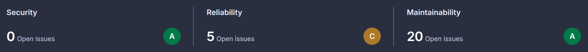

# Report

## 1. System's Perspective

<!--- A description and illustration of the: -->

<!--- Design and architecture of your ITU-MiniTwit systems. -->
### 1.1

<!--- All dependencies of your ITU-MiniTwit systems on all levels of abstraction and development stages. That is, list and briefly describe all technologies and tools you applied and depend on. -->
### 1.2

<!--- Describe the current state of your systems, for example using results of static analysis and quality assessments. -->
### 1.3 Current State of Our Systems
The current state of our system leaves it steadily functional across performance, scalability, code quality, security, and testing. However there are still some limiting factors that exclude it from being entirely production-ready. 

In regards to performance and scalability, the primary issue we encountered is the resources available to the server being insufficient for exceptionally high traffic. However, that is relatively easily managed by upgrading the server plan on DigitalOcean. 

The test coverage is quite extensive across the API and browser-based UI levels, but there could be more explicit tests for base application logic, as well as error and edge-case interactions and security behavior. 

#### Static Analysis and Code Quality Tools
- **SonarQube** indicate some potential security hotspots and issues with reliability, but overall still rates the application A-ratings in security and maintainability. 
- **Codacy** gives the application as a whole an A-rating, but also indicates a few potential security hotspots.
- **CodeQL** passes on all its vulnerability checks. It only fails on javascript due to a file being empty.
- **Hadolint** and **Rosylnator** show no issues.

#### SonarQube's Quality Assessment:

## 2. Process' perspective
<!--- 
This perspective should clarify how code or other artifacts come from idea into the running system and everything that happens on the way.
In particular, the following descriptions should be included: -->

<!--- A complete description and illustration of stages and tools included in the CI/CD pipelines, including deployment and release of your systems. -->
### 2.1

<!--- How do you monitor your systems and what precisely do you monitor? -->
### 2.2

<!--- What do you log in your systems and how do you aggregate logs? -->
### 2.3

<!--- Brief description of how you security hardened your systems. -->
### 2.4

<!--- How do you handle availability and scaling in your systems? -->
### 2.5

## 3. Reflection Perspective

<!--- Describe the biggest issues, how you solved them, and which are major lessons learned with regards to: evolution and refactoring, operation, and maintenance 

of your ITU-MiniTwit systems. Link back to respective commit messages, issues, tickets, etc. to illustrate these.

Also reflect and describe what was the "DevOps" style of your work. For example, what did you do differently to previous development projects and how did it work?
-->

<!--- evolution and refactoring -->
### 3.1 Evolution and Refactoring

<!--- operation -->
### 3.2 Operation

<!--- maintenance -->
### 3.3 Maintenance

## 4. Use of Generative AI
<!---
ITU's rules on the use of generative AI apply for this report too. They are described here and in detail here. 
Please follow them. For your report that means that you have to state which generative AI tools have been used for which task(s) in your projects. 
Additionally, describe how generative AI tools have been used and briefly reflect and discuss how they supported or hindered your work process.
-->

<!--- Mie -->

<!--- Daniel -->

<!--- Mads -->

<!--- Kris -->

<!--- Patrick -->

<!--- Tien -->